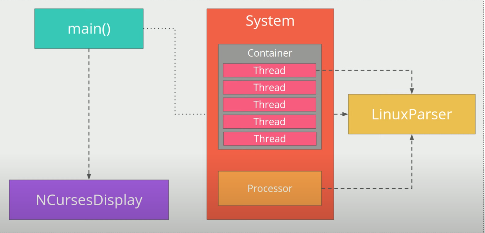

# CppND-System-Monitor

This is a side project I created based on the System Monitor Project in the Object Oriented Programming Course of the [Udacity C++ Nanodegree Program](https://www.udacity.com/course/c-plus-plus-nanodegree--nd213).

## Udacity Linux Workspace
[Udacity](https://www.udacity.com/) provides a browser-based Linux [Workspace](https://engineering.udacity.com/creating-a-gpu-enhanced-virtual-desktop-for-udacity-497bdd91a505) for students. 

You are welcome to develop this project on your local machine, and you are not required to use the Udacity Workspace. However, the Workspace provides a convenient and consistent Linux development environment we encourage you to try.

## ncurses
[ncurses](https://www.gnu.org/software/ncurses/) is a library that facilitates text-based graphical output in the terminal. This project relies on ncurses for display output.

Within the Udacity Workspace, `.student_bashrc` automatically installs ncurses every time you launch the Workspace.

If you are not using the Workspace, install ncurses within your own Linux environment: `sudo apt install libncurses5-dev libncursesw5-dev`

## Make
This project uses [Make](https://www.gnu.org/software/make/). The Makefile has four targets:
* `build` compiles the source code and generates an executable
* `format` applies [ClangFormat](https://clang.llvm.org/docs/ClangFormat.html) to style the source code
* `debug` compiles the source code and generates an executable, including debugging symbols
* `clean` deletes the `build/` directory, including all of the build artifacts

## Instructions

1. Clone the project repository: `git clone https://github.com/udacity/CppND-System-Monitor-Project-Updated.git`

2. Build the project: `make build`

3. Run the resulting executable: `./build/monitor`

4. Follow along with the lesson.

5. Implement the `System`, `Process`, and `Processor` classes, as well as functions within the `LinuxParser` namespace.

6. Submit!

## Data flow

The following is an explanation of the program's **data flow** based on the provided structure and components:

---

### **1. Program Initialization**
- **`main()`**:
  - The program starts from the `main()` function.
  - In `main()`, the main objects are initialized:
    - **`System`**: Manages all system information.
    - **`NCursesDisplay`**: Displays system information on the command-line interface.
  - `NCursesDisplay::Display()` is called to start displaying information.

---

### **2. Retrieving Data from the System**
- **`System`**:
  - The `System` class is responsible for retrieving data from the system through `LinuxParser`.
  - Methods in `System` call the corresponding functions in `LinuxParser` to retrieve information:
    - **CPU**: `LinuxParser::CpuUtilization()` returns CPU utilization.
    - **Memory**: `LinuxParser::MemoryUtilization()` returns memory utilization.
    - **Uptime**: `LinuxParser::UpTime()` returns the system's uptime.
    - **Processes**:
      - `LinuxParser::Pids()` returns a list of PIDs (Process IDs).
      - `LinuxParser::Command()`, `LinuxParser::Ram()`, `LinuxParser::User()`, etc., return detailed information for each process.
    - **Operating System and Kernel**:
      - `LinuxParser::OperatingSystem()` returns the operating system name.
      - `LinuxParser::Kernel()` returns the kernel version.

---

### **3. Data Processing**
- **`Processor`**:
  - The `Processor` class processes CPU-related information, such as calculating CPU utilization based on data from `LinuxParser`.
- **`Process`**:
  - Each process is represented by a `Process` object.
  - `Process` retrieves detailed information for each process from `LinuxParser` (such as PID, RAM, CPU utilization, uptime, etc.).
- **`System`**:
  - The `System` class aggregates data from `Processor`, the `Process` list, and other information (memory, uptime, etc.).

---

### **4. Data Display**
- **`NCursesDisplay`**:
  - The `NCursesDisplay` class is responsible for displaying data on the command-line interface.
  - It consists of two main parts:
    1. **`DisplaySystem()`**:
       - Displays general system information, such as:
         - Operating system name.
         - Kernel version.
         - CPU and memory utilization (as progress bars).
         - Total number of processes and number of running processes.
         - System uptime.
    2. **`DisplayProcesses()`**:
       - Displays a list of processes, including:
         - PID.
         - Username.
         - CPU utilization.
         - RAM.
         - Uptime.
         - Command being executed.
  - `NCursesDisplay` continuously updates data from `System` and displays information in real-time.

---

### **Data Flow Summary**
1. **Data from the System**:
   - `LinuxParser` reads data from system files in proc (e.g., stat, meminfo, `/proc/[PID]/status`, etc.).
2. **Data Processing**:
   - `System` and its child components (`Processor`, `Process`) process and store the data.
3. **Data Display**:
   - `NCursesDisplay` retrieves data from `System` and displays it on the command-line interface.

---

### **Visual Data Flow**
1. **`LinuxParser`**:
   - Retrieves data from proc.
2. **`System`**:
   - Calls `LinuxParser` to retrieve data.
   - Manages CPU (`Processor`) and the process list (`Process`).
3. **`NCursesDisplay`**:
   - Calls `System` to retrieve data.
   - Displays system and process information.

---

### **Specific Example**
- **CPU Utilization**:
  1. `NCursesDisplay` calls `System::Cpu()`.
  2. `System::Cpu()` returns a `Processor` object.
  3. `Processor` calls `LinuxParser::CpuUtilization()` to retrieve data from stat.
  4. `Processor` calculates CPU utilization and returns the result.
  5. `NCursesDisplay` displays CPU utilization as a progress bar.

- **Process List**:
  1. `NCursesDisplay` calls `System::Processes()`.
  2. `System::Processes()` returns a list of `Process` objects.
  3. Each `Process` calls `LinuxParser` to retrieve detailed information (PID, RAM, CPU, etc.).
  4. `NCursesDisplay` displays the process list.

---

### **Conclusion**
The program's data flow is designed following a layered model:
- **`LinuxParser`**: Retrieves data from the system.
- **`System`**: Manages and processes data.
- **`NCursesDisplay`**: Displays data on the command-line interface.

This organization makes the program easy to maintain, extend, and reuse.
